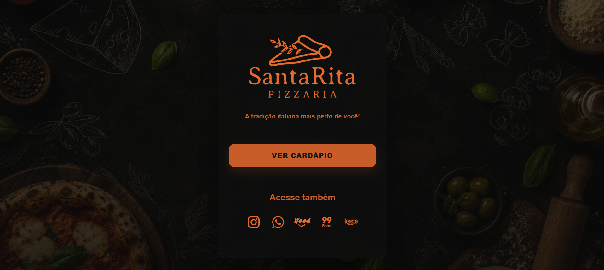
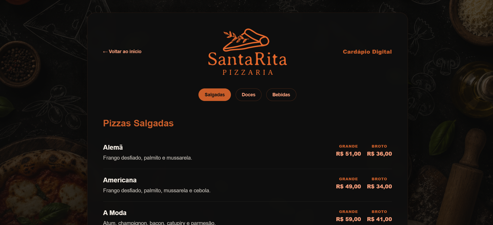

<h1 align="center">🍕 Santa Rita Pizza</h1>

<p align="center">
  Landing page e cardápio digital desenvolvido para uma pizzaria real, com foco em apresentação comercial, navegação simples e experiência responsiva.
</p>

<p align="center">
  
  
  
</p>

---

## ✨ Sobre o projeto

O **Santa Rita Pizza** é um projeto front-end comercial desenvolvido para uma pizzaria, com o objetivo de apresentar o negócio de forma clara, visual e acessível.

A proposta foi criar uma página simples e funcional, permitindo que clientes conheçam a pizzaria, naveguem pelo cardápio digital e encontrem as principais informações do estabelecimento com facilidade.

Este projeto foi finalizado e entregue ao cliente.

---

## 🎯 Objetivo

Criar uma presença digital para a pizzaria, oferecendo uma página web com identidade visual, apresentação dos produtos e acesso simples ao cardápio.

O projeto foi pensado para ser direto, leve e fácil de navegar, especialmente para usuários que acessam pelo celular.

---

## 🧩 Funcionalidades entregues

* Página inicial de apresentação da pizzaria
* Cardápio digital
* Listagem de produtos
* Organização visual por seções
* Estrutura responsiva
* Navegação simples entre páginas
* Deploy online
* Estrutura de arquivos organizada por responsabilidade

---

## 🛠️ Tecnologias utilizadas

<p align="left">
  
</p>

* **HTML5** — estrutura das páginas
* **CSS3** — estilização, identidade visual e responsividade
* **JavaScript** — interações e manipulação de dados do cardápio
* **Vercel** — publicação do projeto
* **Git e GitHub** — versionamento e organização do código
* **VS Code** — ambiente de desenvolvimento

---

## 📁 Estrutura do projeto

```text
santaritapizza/
├── css/
│   └── arquivos de estilo
├── dados/
│   └── dados utilizados no cardápio
├── img/
│   └── imagens utilizadas no projeto
├── js/
│   └── scripts do projeto
├── cardapio.html
├── index.html
└── README.md
```

---

## 🚀 Deploy

Acesse o projeto online:

[Santa Rita Pizza - Vercel](https://santaritapizza.vercel.app/)

---

## 🖼️ Preview

### Página inicial


### Cardápio



---

## 💼 Tipo de projeto

Este foi um projeto desenvolvido para cliente real, com escopo voltado para presença digital simples e apresentação de produtos.

O foco da entrega foi criar uma solução web objetiva para um pequeno negócio, priorizando clareza, estética, responsividade e facilidade de acesso às informações.

---

## 🧠 Aprendizados

Durante o desenvolvimento deste projeto, pratiquei:

* criação de páginas comerciais com HTML, CSS e JavaScript;
* organização de estrutura front-end;
* construção de cardápio digital;
* adaptação visual para um negócio real;
* publicação de projeto com Vercel;
* cuidado com apresentação, navegação e responsividade;
* entrega de um projeto real para cliente.

---

## 👩‍💻 Desenvolvedora

Projeto desenvolvido por **Wendy** 🌸

---

<p align="center">
  Projeto finalizado, entregue e feito com HTML, CSS, JavaScript e uma boa fatia de criatividade 🍕✨
</p>
